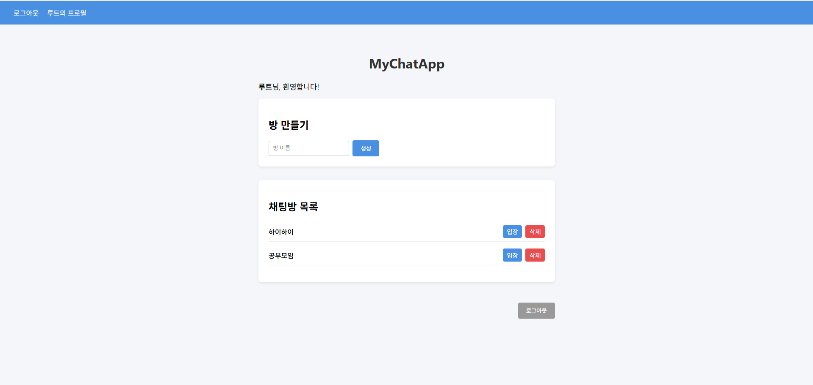

## Gif Chat - 실시간 GIF 채팅 웹 애플리케이션 
> 사용자가 채팅방을 생성하고, 실시간으로 텍스트 및 GIF 이미지를 주고받을 수 있는 웹 기반 채팅 플랫폼
> 로그인/회원가입, 채팅방 관리, 실시간 메시지 송수신, GIF 업로드 등 기능 구현

---

##  기술 스택

| 분야 | 기술 |
|------|------|
| 서버 | Node.js + Express |
| 템플릿 | Nunjucks |
| 실시간 통신 | Socket.IO |
| DB | MySQL + Sequelize ORM |
| 인증 | Passport + express-session |
| 파일 업로드 | Multer (GIF 지원) |
| 기타 | dotenv, bcrypt, morgan 등 |

---

## ✨ 주요 기능

| 기능 | 설명 |
|------|------|
|  **회원가입/로그인** | bcrypt로 비밀번호 암호화, passport-local로 인증 처리 |
|  **실시간 채팅** | socket.io를 통한 실시간 메시지 및 이미지 송수신 |
|  **GIF 업로드** | multer로 GIF 파일 저장, DB에 경로 저장 후 전송 |
|  **채팅방 생성/삭제** | 로그인 후 방 생성 가능, 본인이 생성한 방만 삭제 가능 |
|  **프로필 관리** | 본인의 닉네임 변경 및 내가 만든 방 확인 가능 |
|  **접근 제한** | 비로그인 사용자는 채팅방 접근 불가 (passport 응용 미들웨어) |

---

## 실시간 채팅 처리 흐름
1. 사용자가 채팅방 입장 시 `socket.join(roomId)`로 소켓 그룹 지정
2. 메시지 전송 시:
   - 텍스트만: `socket.emit('chat', {message, roomId})`
   - GIF 포함: `/room/:id/gif`에 POST 업로드 후, `chat` 이벤트 emit
3. 서버는 메시지를 DB에 저장, `io.to(roomId).emit('chat', {...})`로 해당 방 사용자에게 전송

---

## 기능 시연 이미지

| 메인 화면 | 채팅방 입장 | GIF 전송 |
|-----------|-------------|----------|
|  |  |  |

| 로그인 후 화면 | 프로필 관리 |
|----------------|--------------|
|  |  |
